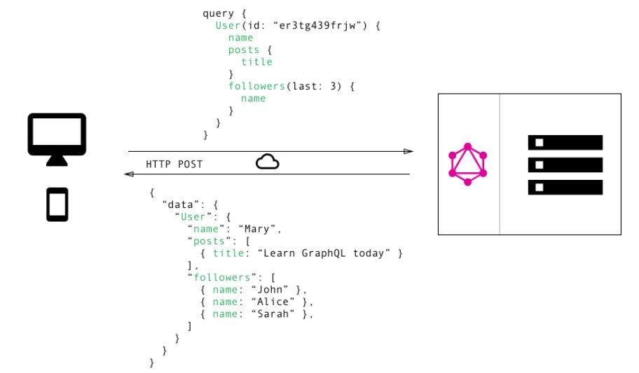

### >> (ing) to an   **API-Driven** **Architecture**

---

## About us

----

<!-- .slide: class="about" -->

-  <!-- .element: class="desaturate" -->
  - **Jean-Francois James**
  - <i class="fa fa-twitter"></i> [@jefrajames](https://twitter.com/jefrajames)
  - <i class="fa fa-pencil"></i> [Worldline engineering Blog](https://blog.worldline.tech)
- 
  - **Nicolas Carlier**
  - <i class="fa fa-twitter"></i> [@ncarlier](https://twitter.com/ncarlier)
  - <i class="fa fa-github"></i> [github.com/ncarlier](https://github.com/ncarlier)
  - <i class="fa fa-pencil"></i> [Worldline engineering Blog](https://blog.worldline.tech)

----

<!-- .slide: data-background="img/worldline-bg.jpg" -->

---

<!-- .slide: class="little-prince" -->

## Draw me an API

Note:

Before we roll our fingers on the keyboard, we need to take a step back and take
the time to ask ourselves important questions about the API architecture we want to build.

----

## For which scope?

- Public?
- Private?

Note:

Is our API public? On the Internet? Or is our API private, used by internal or
external systems?

----

## For which consumer?

- An human?
- A machine?
- A mobile device?

Note:

For what type of consumer? A human? A machine? A machine with specific
constraints such as a mobile device?

----

## For what purpose?

- Technical or business?
- Manage resources (CRUD)?
- Trigger actions?
- Publish/subscribe events (Streaming)?
- ...

Note:

And finally for what purpose? For technical use? Or a business use?
Serving a simple resource management service (CRUD) for something more complex,
such as a remote function or process? For synchronous or asynchronous use?
Or for a particular use such as streaming?

All those questions should be address! And don't be a fool...

----

<!-- .slide: data-background="img/black-cloud-bg.jpg" class="sauron" -->

## Don't bother me! I want...

> An API to rule them all, one API to find them, One API to bring them all and
> in the darkness bind them.

Note:

Not all API architectures are built in the same way.
Functional Requirements AND non-functional requirements have an impact on your
design.
In this presentation, we will try to present you the concepts and tools that
seem useful to us to choose an API oriented architecture adapted to your
challenges.

---

### Select your paradigm

<!-- .slide: class="no-dot" -->

- <!-- .element: class="fragment" --> <i class="fa fa-square-o"></i> Operation
- <!-- .element: class="fragment" --> <i class="fa fa-square-o"></i> Resource
- <!-- .element: class="fragment" --> <i class="fa fa-square-o"></i> Data
- <!-- .element: class="fragment" --> <i class="fa fa-square-o"></i> Function

Note:

Let's choose our first concept: the paradigm. Are we concerned by a model based
on operations, resources, data or functions?

----

### Operation (RPC)

> About apply an operation on something

----

### Operation: Technologies

- RMI (just kidding)
- SOAP (no kidding... almost)
- [gRPC](https://grpc.io/) (based on [Protocol Buffers](https://developers.google.com/protocol-buffers/))
- [Apache Thrift](https://thrift.apache.org/)
- [Apache Avro](http://avro.apache.org)

Note:

The technologies around the operational model are undoubtedly the oldest and
therefore the most mastered.
We are talking about...

SOAP is still widely used. Although not particularly appreciated because of its
verbosity and its old fashion tooling, SOAP is still today a robust solution and
adapted to most RPC usages.

But in IT, performance and efficiency matter. This is why alternatives have
emerged to bring significant gains on these aspects.

We can find...

----

### Operation: Key features

- Highly typed
- Code generation
- Documentation generation
- Efficient/Modular serialization implementation
- Efficient/Modular transport mechanism

Note:

Operational model have those key features: ...

----

### Resource

> About resource manipulation

Note:

Another well known paradigm is the resource manipulation.
This was mainly brought by REST....

----

### Resource: Technologies

- REST (representational state transfer)
- RESTFul (representational state transfer)
- RESTAwful SOUP (basically SOAP with JSON)

Note:

REST is mostly about stateless servers and structured access to resources (business entities) enabling light coupling.

A common design "alternative" is to mix the operational and resource models.
If you don't have a good recipe, you get a RESTawful SOUP that is relatively
indigestible from a code and usage point of view.
Risk to create "RPC-like" interface on top of HTTP and JSON leading to high-coupling.

----

### Resource: Key features

- Web friendly
- Human readable
- Cacheability
- Uniform interface

Note:

Resource model have those key features: ...

----

### Quick FOCUS on REST

- Now the most popular choice for API development
- REST is not about using HTTP and JSON, JSON-RPC is not REST
- It is an architetcure style for Network-based Software specified by [Dr. Roy Fielding in 2000](http://www.ics.uci.edu/~fielding/pubs/dissertation/top.htm)
- Based on 6 constraints: client-server, stateless, cache, uniform interface, layered system, code on demand (optional)
- Mostly about stateless servers and structured access to resource (business entities)

Note:

- Let's have a quick focus on REST.
- Roy Fielding dissertation "Architectural Styles and the Design of Network-based Software Architecture".
- Very flexible: data is not tied to methods and resources.
- Ability to handle multiple types of calls and data formats: XML, JSON, YAML ...
- Structural changes enabled by HATEOS: Hypermedia As The Engine of system State.

----

### Data

> About structured data manipulation

Note:

REST is cool but have some drawbacks.
In particular, multiplicity of endpoints, over and under data fetching.
Too rigid for certain use cases.
And let's move on another emerging paradigm: the data manipulation.
This was mainly brought by GraphQL ...

----

### Data: Technolog~~ies~~y

<!-- .slide: class="no-dot" -->

- 
- [GraphQL](http://graphql.org/) by Facebook

----

### Data: Key features

- "It's Graphs All the Way Down"
- [Specification](https://github.com/facebook/graphql) and Reference Implementation from Facebook 
- Schema-driven development: data and operations
- Two kinds of operation: Query and Mutation
- Client friendly: self-describing enabling introspection
- Different implementations including [graphql-java](https://github.com/graphql-java/graphql-java)

Note:

- REST APIs have shown to be too inflexible to keep up with the rapidly changing requirements of the clients that access them.
- This is particularly true for mobile Apps.
- GraphQL was developed by Facebook to cope with the need for more flexibility and efficiency.
- Specification and Reference Implementation developped and maintained by Facebook.
- A contract is established between the consumers and the provider in the form of a schema.
- Defines datatypes, queries and mutations.
- A single endpoint to serve all queries and mutations.
- Consumers specifies which data they want to get back: avoid under and over fetching.
- GraphiQL: generic client.

----

### FOCUS on GraphQL

Note:
- This is a typical GraqhQL query.
- It consists in retrieving data from a given user.
- The client provides ther userid and the data it wants to get back: the user name, the list of posts and the 3 last followers.

---

### Select your data protocol

<!-- .slide: class="no-dot" -->

- <!-- .element: class="fragment" --> <i class="fa fa-square-o"></i> Human friendly
- <!-- .element: class="fragment" --> <i class="fa fa-square-o"></i> Machine friendly

Note:

Move on to our second topic: the selection of the data protocol
...

----

### Human friendly

Textual data protocol:

- &lt;XML/&gt;
- {JSON}

----

### Textual protocol (JSON)

- Easy to read/debug/trace...
- Ideal for web apps

- Still performant... **but**:
  - Weakly typed (without schema)
  - Heavy bandwidth (without compression)
  - Heavy memory footprint (at scale)

----

### Machine friendly

Binary data protocol:

- [Protobuf](https://developers.google.com/protocol-buffers/)
- [Apache Avro](https://avro.apache.org/)
- [MessagePack](https://msgpack.org/): *"It's like JSON but fast and small."*

----

### Binary protocol

- Very efficient (bandwidth, CPU, memory)
- Safe (Highly typed, structured)
- Ideal for... machines
- **But** Hard to read/debug

---

### Select your access control:

<!-- .slide: class="no-dot" -->

- <!-- .element: class="fragment" --> <i class="fa fa-square-o"></i> Free 2 play
- <!-- .element: class="fragment" --> <i class="fa fa-square-o"></i> API key
- <!-- .element: class="fragment" --> <i class="fa fa-square-o"></i> Token based
- <!-- .element: class="fragment" --> <i class="fa fa-square-o"></i> x509

----

## Free 2 Play

- but restricted
- rate limiting
- IP restriction
- ...

----

## API Key

- clever for some needs
- Basic auth

----

## Token based

- OAuth2
- OpenID Connect
- Macaroon

---

## Select your documentation:

<!-- .slide: class="no-dot" -->

- <!-- .element: class="fragment" --> <i class="fa fa-square-o"></i> Auto generated
- <!-- .element: class="fragment" --> <i class="fa fa-square-o"></i> Self carried
- <!-- .element: class="fragment" --> <i class="fa fa-square-o"></i> Semi-auto generated

----

## Auto generated

- WSDL
- WADL
- Protocol definition

----

## Self carried

- "Affordance"
- HAL / HATEOAS

----

## Semi-auto generated

- RAML
- Swagger
- OpenAPI

----

## **But**, this is not enough!

> Most of the time, you have to provide a clean and human readable **online**
> documentation.

---

## Select your versioning strategy:

<!-- .slide: class="no-dot" -->

- <!-- .element: class="fragment" --> <i class="fa fa-square-o"></i> Versioning: a necessary evil
- <!-- .element: class="fragment" --> <i class="fa fa-square-o"></i> URL
- <!-- .element: class="fragment" --> <i class="fa fa-square-o"></i> Content-type
- <!-- .element: class="fragment" --> <i class="fa fa-square-o"></i> Specific HTTP header
- <!-- .element: class="fragment" --> <i class="fa fa-square-o"></i> No versioning

Note:

Versioning is costly to you and the consumers.
To be used with care: do not disrupt your consumers.
Not for: addition of new resources, of data in the response, changed technologies (Java to Ruby), changed your application's services
Only if backward-incompatible. Can be avoided for internal API where control and influence over all the consumers.

...

---

## Select your tooling:

<!-- .slide: class="no-dot" -->

- <!-- .element: class="fragment" --> <i class="fa fa-square-o"></i> API management
- <!-- .element: class="fragment" --> <i class="fa fa-square-o"></i> IAM
- <!-- .element: class="fragment" --> <i class="fa fa-square-o"></i> FaaS
- <!-- .element: class="fragment" --> <i class="fa fa-square-o"></i> Service registry

----

## What is API management

- API gateway (AuthN/AuthZ/Trafic control/Routing/Logging/Analytics/Monitoring/Transformation)
- Analytic platform (TSDB/RT Monitoring)
- Development portal (CMS, Clinet registration)
- Facade API (aggregation/composition/transformation/micro routing)

----

## What is NOT API management

- API beautyfier/performer (lipstick on a pig)
- API translator
- About business logic
- Firewall

----

## Here come the  competitors

<!-- .slide: class="no-dot logos" -->

- 
- 
- 
- 

---

## Select your API architecture:

<!-- .slide: class="no-dot" -->

- <i class="fa fa-check-square-o"></i> Like Gandalf (Wisely)
- <i class="fa fa-square-o"></i> Like Sauron

# Thanks!

