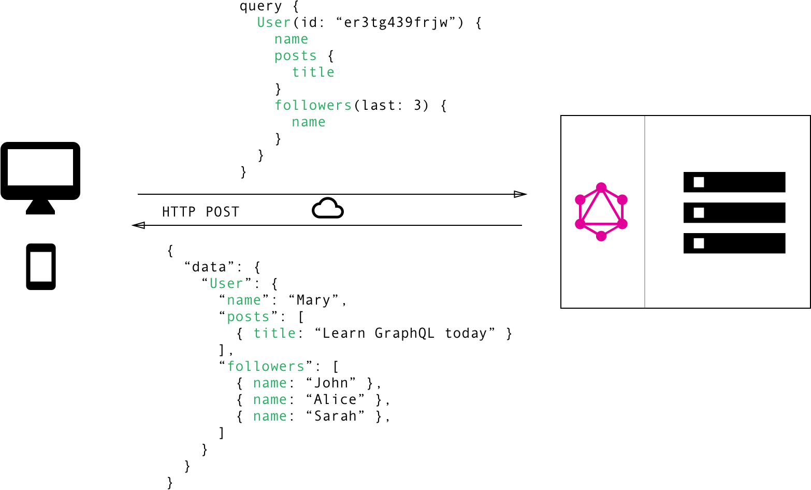
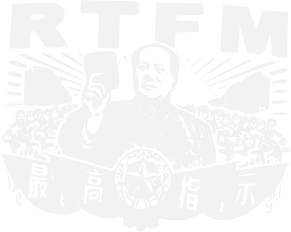

### >> (ing) to an   **API-Driven** **Architecture**

---

## About us

----

<!-- .slide: class="about" -->

-  <!-- .element: class="desaturate" -->
  - **Jean-Francois James**
  - <i class="fa fa-twitter"></i> [@jefrajames](https://twitter.com/jefrajames)
  - <i class="fa fa-pencil"></i> [Worldline engineering Blog](https://blog.worldline.tech)
- 
  - **Nicolas Carlier**
  - <i class="fa fa-twitter"></i> [@ncarlier](https://twitter.com/ncarlier)
  - <i class="fa fa-github"></i> [github.com/ncarlier](https://github.com/ncarlier)
  - <i class="fa fa-pencil"></i> [Worldline engineering Blog](https://blog.worldline.tech)

----

<!-- .slide: data-background="img/worldline-bg.jpg" -->

---

<!-- .slide: class="little-prince" -->

## Draw me an API

Note: jf

Before we roll our fingers on the keyboard, we need to take a step back and take
the time to ask ourselves important questions about the API architecture we want
to build.

----

## For which scope?

- Public?
- Private?

Note: jf

Is our API public? On the Internet? Or is our API private, used by internal or
external systems?

----

## For which consumer?

- An human?
- A machine?
- A mobile device?

Note: jf

For what type of consumer? A human? A machine? A machine with specific
constraints such as a mobile device?

----

## For what purpose?

- Technical or business?
- Manage resources (CRUD)?
- Trigger actions?
- Publish/subscribe events (Streaming)?
- ...

Note: jf

And finally for what purpose? For technical use? Or a business use?
Serving a simple resource management service (CRUD) for something more complex,
such as a remote function or process? For synchronous or asynchronous use?
Or for a particular use such as streaming?

n: All those questions should be address! And don't be a fool...

----

<!-- .slide: data-background="img/black-cloud-bg.jpg" class="sauron" -->

## Don't bother me! I want...

> An API to rule them all, one API to find them, One API to bring them all and
> in the darkness bind them.

Note: n

Not all API architectures are built in the same way.
Functional Requirements AND non-functional requirements have a strong impact on
your design.
In this presentation, we will try to give you a brief overview of concepts and
tools useful to build an API oriented architecture adapted to your requirements.

---

<!-- .slide: class="no-dot section" -->

### Select your **paradigm**

- <!-- .element: class="fragment" --> <i class="fa fa-square-o"></i> Operation
- <!-- .element: class="fragment" --> <i class="fa fa-square-o"></i> Resource
- <!-- .element: class="fragment" --> <i class="fa fa-square-o"></i> Data
- <!-- .element: class="fragment" --> <i class="fa fa-square-o"></i> Function

Note: n

Let's choose our first concept: the paradigm. Are we concerned by a model based
on operation, resource, data or function?

----

### Operation

> About apply an operation on something

Note: n

It's...
Basically, you call a remote procedure. You get the point, we're talking about
RPC in a more technical way.

----

### Operation (RPC): Technologies

- RMI (just kidding)
- SOAP (no kidding... almost)
- [gRPC](https://grpc.io/) (based on [Protocol Buffers](https://developers.google.com/protocol-buffers/))
- [Apache Thrift](https://thrift.apache.org/)
- [Apache Avro](http://avro.apache.org)
- [TChannel](https://github.com/uber/tchannel)...

Note: n

The technologies around the operational model are undoubtedly the oldest and
therefore the most mastered.
We are talking about...

SOAP is still widely used. Although not particularly appreciated because of its
verbosity and its old fashion tooling, SOAP is still today a reliable and well
known service contract between two industrial actors.

But in IT, performance and efficiency matter. This is why alternatives have
emerged to bring significant gains on these aspects.

We can find...
We still have a service contract, but less verbose and using much more efficient
underlying technology: like structured data, binary protocols.

For the record, gRPC is widely used by google's internal services. Thrift is
used by high performant products like Cassandra. And Uber created his own open
protocol for his internals: TChannel.

----

### Operation: Key features

- Highly typed
- Code generation
- Documentation generation
- Efficient/Modular serialization implementation
- Efficient/Modular transport mechanism

Note: n

Here the key features of the operational model:
This is highly typed, therefore you reduce errors and facilitate tooling such as
code and documentation generators.
Resource usage is a first class concern. Therefore data serialization and data
transport are efficient.

----

### Resource

> About resource manipulation

Note: n

Another well known paradigm is the resource manipulation.
This was mainly brought by REST....

----

### Resource: Technologies

- RESTful (representational state transfer): structured access to resources
- RESTAwful SOUP (basically SOAP with JSON): less structured

<!-- .element: class="more" --> [OCTO refcard](https://blog.octo.com/strategie-d-architecture-api/)

Note: n

REST is mostly an "architectural style" built upon Web technologies.
It's a structured access to resources.

A less structured design commonly used is to mix the operational and resource
models.
In a lack of a decent recipe, you will get a REST SOUP that is awful (from a
code and usage point of view).
We will get back to it in a moment.

----

### Resource: Key features

- Web friendly
- Human readable
- Uniform interface

Note: n

Resource model have those key features:
It's Web friendly because build on top of web technologies. Therefore you inherit
some powerful features like cache management, security, routing, etc.
Most of the time JSON is used as data protocol. Therefor it is human readable
and as a result easy to debug or understand.
It's an uniform interface that simplifies and decouples the architecture,
which enables parts to evolve independently.

----

### Quick FOCUS on REST  (1/2)

- It is an **architecture style** for network-based Software specified by [Dr. Roy Fielding in 2000](http://www.ics.uci.edu/~fielding/pubs/dissertation/top.htm)
- Mostly about stateless servers and structured access to resource (business entities)

Note: jf

Let's have a quick focus on REST...

Its' currently he most popular choice for API development
It's not just about HTTP and JSON (JSON-RPC is not REST)

Roy Fielding dissertation "Architectural Styles and the Design of network-based
Software Architecture".

Very flexible: data is not tied to methods and resources.
Ability to handle multiple types of calls and data formats: XML, JSON, YAML ...
Structural changes enabled by HATEOS: Hypermedia As The Engine of system State.

----

### Quick FOCUS on REST  (2/2)

Based on **6 big principles**:

- Client/Server
- Stateless
- Cache
- Uniform interface
- Layered system
- Code on demand (optional)

Note: jf

...

----

### Data

> About structured data manipulation

Note: n

REST is cool but have some drawbacks.
Such as: multiplicity of endpoints, over or under data fetching, some
rigidity...
So let's move on another emerging paradigm: the data manipulation.
This was mainly brought by GraphQL ...

----

### Data: Technolog~~ies~~y

<!-- .slide: class="no-dot" -->

- 
- [GraphQL](http://graphql.org/) by Facebook

Note: jf

GraphQL was created by FB in response of particular concerns:
- the multiplicity of endpoints in relation of the myriad of client apps.
- the over/uder data fetching regarding the true need of the client app

REST APIs have shown to be too inflexible to keep up with the rapidly changing
requirements of the clients that access them.

GraphQL was developed by Facebook to cope with the need for more flexibility and
efficiency.

This is particularly true for mobile Apps.

Let's have a closer look to the technology:

----

### Deep (not so) dive into GraphQL (1/2)

Concepts:

- "It's Graphs All the Way Down"
- Schema definition Language (SDL)
- Fetching relevant data with Query
- Writing data with Mutations
- Realtime updates with subscriptions
- Single endpoint

<!-- .element: class="more" --> [Node tutorial](https://medium.com/@tomlagier/scaffolding-a-rock-solid-graphql-api-b651c2a36438)

Note: jf

- A contract is established between the consumers and the provider in the form
  of a schema.
- Defines datatypes, queries and mutations.
- A single endpoint to serve all queries and mutations.
- Consumers specifies which data they want to get back: avoid under and over
  fetching.
- Different implementations including [graphql-java](https://github.com/graphql-java/graphql-java)
- self-describing enabling introspection
- backport client complexity to dao
- [Specification](https://github.com/facebook/graphql) and Reference Implementation from Facebook 

----

### Deep (not so) dive into GraphQL (2/2)

Note: jf

- This is a typical GraqhQL query.
- It consists in retrieving data from a given user.
- The client provides ther userid and the data it wants to get back: the user name, the list of posts and the 3 last followers.

---

<!-- .slide: class="no-dot section" -->

### Select your **data protocol**

- <!-- .element: class="fragment" --> <i class="fa fa-square-o"></i> Human friendly
- <!-- .element: class="fragment" --> <i class="fa fa-square-o"></i> Machine friendly

Note: n

Move on to our second topic: the selection of the data protocol.
As you can imagine the way you transmit data matter.
Basically you have the choice to be human or machine friendly.
The choice will depends who is your consumer and what are your constraints
regarding bandwidth and performance.

----

### Human friendly

Textual data protocol:

- &lt;XML/&gt;
- YAML:
- {JSON}

Note: n

Textual data protocols are well known and mainly those.
XML is gradually replaced by JSON. More concise and readable.
YAML is even more concise and readable but a little bit harder to parse by
machines.

----

### Textual protocol (JSON)

- Easy to read/debug/trace...
- Ideal for web apps

- Still [performant](http://blog.ippon.fr/2016/09/26/formats-et-methodes-de-serialisation-rest/)... **but**:
  - Weakly typed (without schema)
  - Heavy bandwidth (without compression)
  - Heavy memory footprint (at scale)

Note:

So the key features are: ...
But there are some drawbacks that you should consider..

----

### Machine friendly

Binary data protocol:

- [Protobuf](https://developers.google.com/protocol-buffers/)
- [Apache Avro](https://avro.apache.org/)
- [MessagePack](https://msgpack.org/): *"It's like JSON but fast and small."*
- ...

Note: n

Here we are the alternative: the binary data protocol
These protocols are successful on mobile phones (as with protobuf), for internal
services communication, or for serialization of data for well known products
such as Hadoop, Cassandra, Redis, etc..

----

### Binary protocol

- Very efficient (bandwidth, CPU, memory)
- Safe (Highly typed, structured)
- Ideal for... machines and heavy load
- **But** Hard to read/debug

Note:

Binary protocols are undoubtedly very effective in terms of resource
utilization.
They are also reliable to use because they are highly typed and defined by
schemas.
It's a very good choice for machine 2 machine communication and when performance
matter.

BUT, they are difficult to read and debug.
Therefore, it may not be a good idea to use this type of protocol a mainstream
external interface.

---

<!-- .slide: class="no-dot section" -->

### Select your   **access control**:

- <!-- .element: class="fragment" --> <i class="fa fa-square-o"></i> Free 2 play
- <!-- .element: class="fragment" --> <i class="fa fa-square-o"></i> API key
- <!-- .element: class="fragment" --> <i class="fa fa-square-o"></i> Token based
- <!-- .element: class="fragment" --> <i class="fa fa-square-o"></i> x509

Note: n

Move on to our next topic: the selection of the access control mechanism.

----

## Free 2 Play

- Public... but restricted
- Rate limiting
- IP restriction
- Usage monitoring
- ...

Note:

In other words, no authentication. Public API.
But not having an AuthN mechanism does not mean not setting up some level of
access control.
Such as a rate limiting filter that protects the API from abuse.
An IP ban system for suspicious users.
An appropriate monitoring system showing us the detailed use of our API.
etc.

----

## API Key

- Not secure... but ideal for some needs
- Good practices:
  - Hashed storage
  - Obtains with strong authentication mechanism
  - For a limited scope of the API (reads, non sensitive actions, etc.)
  - Using basic-auth over SSL

Note:

API key is a single secret sent to the server as credentials.
It's a very poor way to authenticate someone.
BUT, it's still something common to use in order to facilitate the inegration of
other services. It's very simple to use.
But you have to follow some good practices.

----

## Token based

- OAuth2
- OpenID Connect
- Macaroon

Note:

A more secure way to access an API is by using token based standard.
A old one is OAuth2. ...

---

<!-- .slide: class="no-dot section" -->

### Select your **documentation**:

- <!-- .element: class="fragment" --> <i class="fa fa-square-o"></i> Auto generated
- <!-- .element: class="fragment" --> <i class="fa fa-square-o"></i> Self carried
- <!-- .element: class="fragment" --> <i class="fa fa-square-o"></i> Semi-auto generated

Note: jf

...

----

## Auto generated

- WSDL
- WADL
- Protocol definition

Note: jf

...

----

## Self carried

- "Affordance"
- HAL / HATEOAS

Note: jf

...

----

## Semi-auto generated

- RAML
- Swagger
- OpenAPI

Note: jf

...

----

## **But**, this is not enough!

> Most of the time, you have to provide a clean and human readable **online**
> documentation.

Note: jf

...

---

<!-- .slide: class="no-dot section" -->

### Select your   **versioning strategy**:

- <!-- .element: class="fragment" --> <i class="fa fa-square-o"></i> GET /v2/products
- <!-- .element: class="fragment" --> <i class="fa fa-square-o"></i> Accept: application/vnd.myname.v2+json
- <!-- .element: class="fragment" --> <i class="fa fa-square-o"></i> X-API-Version: 2

<!-- .element: class="more" --> [REST versioning](http://www.baeldung.com/rest-versioning)

Note:

Versioning should be consider at the early stage of development.
Even if you don't yet plan an upcoming version.

Versioning is costly to you and the consumers.
To be used with care: do not disrupt your consumers.
Not for: addition of new resources, of data in the response, changed technologies (Java to Ruby), changed your application's services
Only if backward-incompatible. Can be avoided for internal API where control and influence over all the consumers.

...

---

<!-- .slide: class="no-dot section" -->

### Select your tooling:

- <!-- .element: class="fragment" --> <i class="fa fa-square-o"></i> API management
- <!-- .element: class="fragment" --> <i class="fa fa-square-o"></i> IAM
- <!-- .element: class="fragment" --> <i class="fa fa-square-o"></i> FaaS
- <!-- .element: class="fragment" --> <i class="fa fa-square-o"></i> Service registry

----

## What is API management

- API gateway (AuthN/AuthZ/Trafic control/Routing/Logging/Analytics/Monitoring/Transformation)
- Analytic platform (TSDB/RT Monitoring)
- Development portal (CMS, Clinet registration)
- Facade API (aggregation/composition/transformation/micro routing)

----

## What is NOT API management

- API beautyfier/performer (lipstick on a pig)
- API translator
- About business logic
- Firewall

----

## Here come the  competitors

<!-- .slide: class="no-dot logos" -->

- 
- 
- 
- 

---

## Select your API architecture:

<!-- .slide: class="no-dot" -->

- <i class="fa fa-check-square-o"></i> Like Gandalf (Wisely)
- <i class="fa fa-square-o"></i> Like Sauron

# Thanks!

